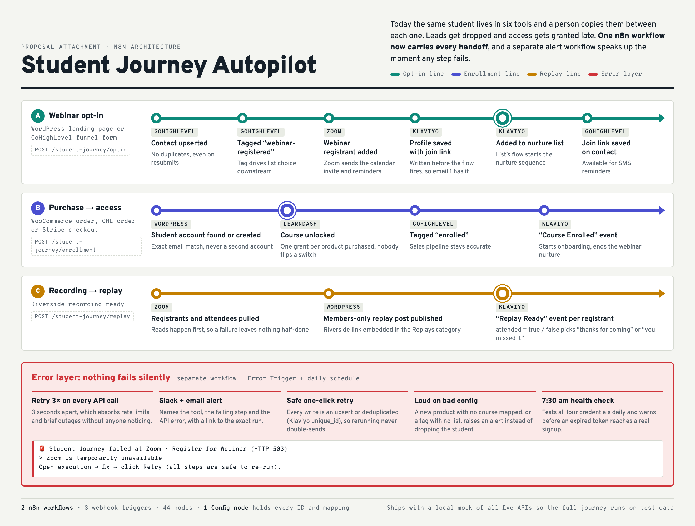

# Student Journey Autopilot (n8n)

One n8n workflow that carries a student from webinar opt-in to course access to replay across
**WordPress · GoHighLevel · Klaviyo · Zoom · LearnDash · Riverside**, plus a separate error
workflow so nothing fails silently.



| File | What it is |
|---|---|
| `workflows/student-journey.json` | Main workflow: 3 webhook lanes (opt-in, purchase, replay) |
| `workflows/error-alerts.json` | Error Trigger → Slack + email, plus a daily 7:30 credential health check |
| `mock/mock_apis.py` | Local stand-in for all five APIs (stdlib Python), with failure injection |
| `demo/fire.sh`, `demo/payloads/` | Test events: WP form, GHL form, WooCommerce order, Riverside recording |
| `docs/architecture.{pdf,png,html}` | One-page visual for the proposal |
| `docs/LOOM_SCRIPT.md` | Timed 3-minute walkthrough script |
| `scripts/build_workflows.py` | Generates the workflow JSON. Edit this, then re-run it |

## Run the demo locally (no real accounts needed)

```bash
python3 mock/mock_apis.py                                   # terminal 1
docker run -it --rm -p 5678:5678 docker.n8n.io/n8nio/n8n    # terminal 2, or `npx n8n` (Node ≥ 24)
```

1. In n8n, import both files in `workflows/`, then create the six credentials from `demo/credentials.demo.json`
   (or with the CLI: `n8n import:credentials --input=demo/credentials.demo.json` and
   `n8n import:workflow --input=workflows/<file>.json`, which keeps the credential and error-workflow links).
2. In the main workflow's **Settings → Error workflow**, pick *Student Journey · Error Alerts + Health Check*
   (UI imports get new IDs, so this link has to be re-selected).
3. Activate both workflows, then:

```bash
./demo/fire.sh optin        # WordPress opt-in: GHL → Zoom → Klaviyo
./demo/fire.sh optin-ghl    # GHL funnel opt-in (this lead is a no-show)
./demo/fire.sh enroll       # WooCommerce order: WP user → LearnDash → GHL → Klaviyo
./demo/fire.sh replay       # Riverside recording: Zoom attendance → WP post → Klaviyo per registrant
./demo/fire.sh unmapped     # product with no course mapped → Slack alert
./demo/fire.sh break zoom && ./demo/fire.sh optin   # 3 retries → Slack alert
./demo/fire.sh heal
```

If n8n runs in Docker, change `MOCK` in both **Load Config** / **Alert Config** nodes to
`http://host.docker.internal:4010`.

## Going live

1. In **Load Config** (and **Alert Config** / **Health Config**) set `DEMO = false` and fill in the IDs:
   GHL location, Zoom account + webinar, Klaviyo list IDs per tag, WooCommerce product → LearnDash course map.
2. Replace the demo credentials:
   - **GoHighLevel**: Private Integration token → header `Authorization: Bearer pit-…`
   - **Klaviyo**: private key → header `Authorization: Klaviyo-API-Key pk_…`
   - **Zoom**: Server-to-Server OAuth app (scopes: `webinar:write:registrant`, `webinar:read:list_registrants`, `report:read:list_webinar_participants`) → Basic auth client id/secret
   - **WordPress**: Application Password for a bot user who can manage users, posts and LearnDash enrollments
   - **Journey Webhook Secret**: a long random value, sent as `X-Journey-Secret` by each source
   - **Alerts SMTP** plus a Slack incoming-webhook URL in Alert Config
3. Point the sources at the production webhook URLs (`/webhook/student-journey/{optin,enrollment,replay}`):
   WP form plugin webhook add-on or GHL workflow "Webhook" action · WooCommerce *Order updated* webhook ·
   Riverside.
4. In Klaviyo, build the flows: *Added to list* (webinar nurture, using `{{ person.zoom_join_url }}`),
   metric *Course Enrolled* (onboarding), and metric *Replay Ready* (split on `event.attended`).
   Add the custom field `zoom_join_url` in GHL.

### Assumptions to confirm with the client
- **LMS**: built for LearnDash (`/ldlms/v2/sfwd-courses/{id}/users`). For Tutor LMS, LifterLMS or MemberPress,
  only the *LearnDash · Grant Course Access* node changes.
- **Riverside**: webhooks and API are only on Riverside's Business plan, and payload field names vary.
  *Normalize Replay* accepts the common shapes. If there's no webhook, the same lane can hang off a
  Google Drive / Dropbox "new file in export folder" trigger instead.
- **GHL custom field** key `zoom_join_url` must exist in the location.
- Zoom list endpoints are fetched at `page_size=300`. Add pagination for webinars larger than that.

## Design notes
- Each source has its own normalizer that maps it to one shape, and every lane after that reads from **Load Config**.
- Every HTTP step retries 3× 3 s apart. After that the Error Trigger workflow posts the node, the API error and
  the execution link.
- Writes are idempotent (GHL upsert, WP find-or-create, LearnDash enroll, Klaviyo `unique_id`), so *Retry* is
  always safe. The replay lane does its Zoom reads before any writes.
- Unmapped products or tags throw on purpose, so a missing mapping raises an alert and the student isn't silently dropped.
